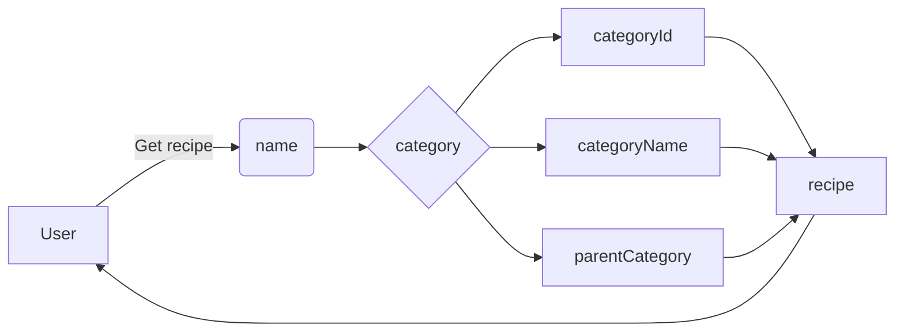

#APIコール

```mermaid
graph LR
  A[User] -->|Get recipe| B(name)
    B --> C{category}
    C --> D[categoryId]
    C --> E[categoryName]
    C -->F[parentCategory]
    D -->G[recipe]
    E -->G
    F -->G 
    G --> A
```